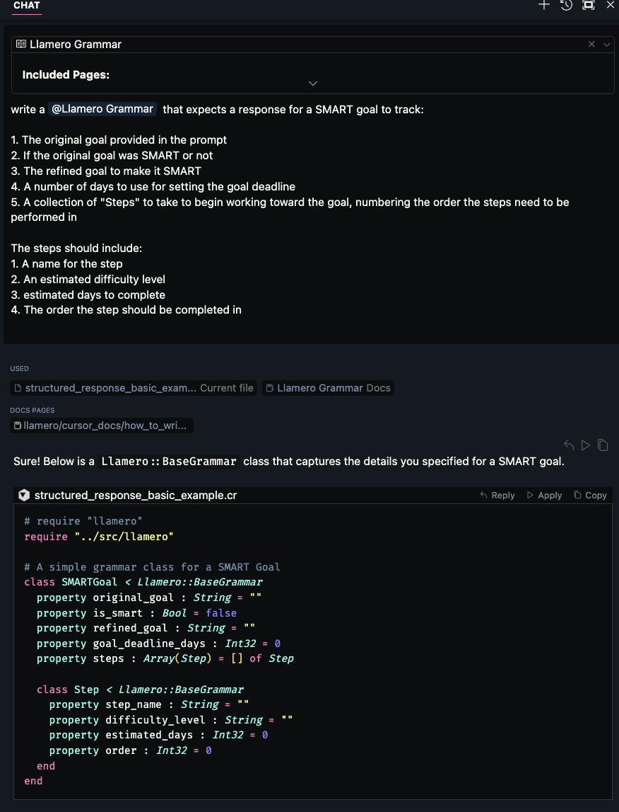
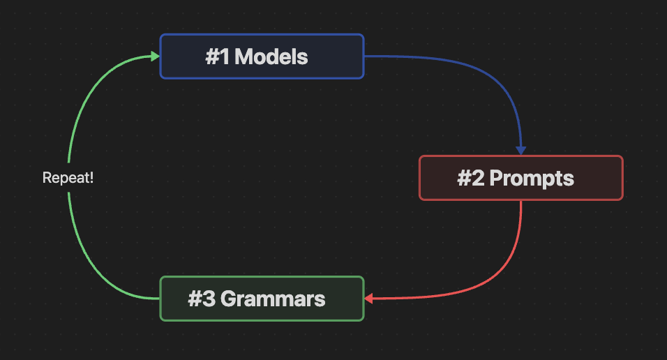

# llamero

`Llamero` is a Crystal shard for interacting with and using LLMs to control your application and give models autonomy. You can speak to an LLM using natural language or unstructured data, while getting structured responses that your application can utilize.

Here's a basic example:

```crystal
require "llamero"

model = Llamero::BaseModel.new(model_name: "meta-llama-3-8b-instruct-Q6_K.gguf")

# Procedes to tell you a terrible joke, AI has horrible taste in jokes.
puts model.quick_chat([{ role: "user", content: "Hey Llama! Tell me your best joke about programming" }])

```

## Before you start

Currently, you will need to clone the llama.cpp repo, build it and symlink the bin to /usr/local/bin/llamacpp for this shard to work as intended.

You will also need python 3.12 or later and pip

```
brew install python3 pip
```

Then you can clone and build llama.cpp

**Important Note: these instructions tie you to an older release of llama.cpp due to a bug that was introduced around late Feb 2024 - March 2024. This bug has not been fixed as of yet, which breaks this shard entirely because the llama.cpp binary will not execute from the symbolic link we want to create for running it outside of the llama.cpp directory.**

```bash
cd ~/ && git clone git@github.com:ggerganov/llama.cpp.git && cd llama.cpp && git fetch --tags && git checkout f1a98c52 && make
```

**You will now be on a stable version of llama.cpp and able to make the symbolic link to run this shard. You will be in a detached HEAD state, so you will need to checkout the `f1a98c52` commit if you intend to switch to master/main or another release.**

Now create the symlink for the main binary, run this from within the llama.cpp directory root

For Mac users, this command will create a symlink for you
```bash
sudo ln -s $(pwd)/llama.cpp/main /usr/local/bin/llamacpp
```

Next we'll link the tokenizer
```bash
sudo ln -s $(pwd)/tokenize /usr/local/bin/llamatokenize
```

You will also need to download some models. This is a quick reference list. You can choose any model that's already quantized into gguf, or you can convert your own models using the llama.cpp quantization tool.

Choose a model from below to start with. The links should bring you directly to the model files page. You want to "download" the model file. 

| Model Name          | Description                                   | RAM Required | Prompt Template |
|---------------------|-----------------------------------------------| ------------ | --------------- |
| [Mixtral dolphin-2.7-mixtral-8x7b-GGUF](https://huggingface.co/TheBloke/dolphin-2.7-mixtral-8x7b-GGUF/blob/main/dolphin-2.7-mixtral-8x7b.Q4_K_M.gguf) | A quantized model optimized for 8x7b settings, works about as well as ChatGPT 4 | ~27GB        | [chat template](https://huggingface.co/TheBloke/dolphin-2.7-mixtral-8x7b-GGUF#prompt-template-chatml) |
| [Mistril-7B-instruct-v0.2-GGUF](https://huggingface.co/TheBloke/Mistral-7B-Instruct-v0.2-GGUF/blob/main/mistral-7b-instruct-v0.2.Q5_K_S.gguf) | A quantized model from Mistril, works about as well as ChatGPT 3.5 | ~6GB | [chat template](https://huggingface.co/TheBloke/Mistral-7B-Instruct-v0.2-GGUF#prompt-template-mistral) |
| [Llama3 8b-Instruct-GGUF](https://huggingface.co/bartowski/Meta-Llama-3-8B-Instruct-GGUF/blob/main/Meta-Llama-3-8B-Instruct-Q5_K_M.gguf) | A quantized model from Llama 3, works about as well as GPT-4 but limited knowledge | ~8GB | [chat template](https://huggingface.co/bartowski/Meta-Llama-3-8B-Instruct-GGUF#prompt-format) |

You can always download a different model, it just needs to be in the `GGUF` quantized format, or you'll need to quantize the model from llama.cpp's quantization tool.

Move the model you downloaded into a directory that you'll configure in your project to use.
I recommend `~/models` as this is the default directory that Llamero will check for models.

## Installation

1. Add the dependency to your `shard.yml`:

   ```yaml
   dependencies:
     llamero:
       github: crimson-knight/llamero
   ```

2. Run `shards install`

## Getting Started

`Llamero` uses several concepts for working with LLMs and your application.

1. **Prompts** - A `Llamero::BasePrompt` is a prompt chain that is used to create a prompt for a model. It typically is used to structure a workflow using prompt engineering techniques.
2. **Grammars (aka Structured Responses)** - A `Llamero::BaseGrammar` is a structured response format that constraints how the LLM _can_ respond. This is a key element of Llamero's functionality that allows you to define a response schema and then easily interact with the models responses.
3. **Models** - A `Llamero::BaseModel` is the model that is used for executing your prompt.
4. **Training** - A `Llamero::BaseTrainingPromptTemplate` is for using your own `grammars` and `prompts` to create synthetic data for training your own prompts and structured responses.

Applications utilize prompts, grammars and models to execute workflows. Workflows are where you spend the majority of your time developing your application. Once you get the primary workflow _mostly_ working, then you can create synthetic data using your grammars and prompts to improve the accuracy of your model responses.

#### Wait, why "mostly" working?

The trick to working with AI, and LLM's in particular, is you are working to get something that works _consistently_. You can quickly get a workflow that works 20-35% of the time, but reaching the 95%+ success range requires various methods of fine-tuning.

## Using Cursor Docs

If you're using the [Cursor](https://cursor.sh) editor, there are special docs that have been created to get the most out of `Llamero`.

In the `ai_docs` folder in this repo, you'll find the following docs that you can add to Cursor to get quick and accurate assistance while coding.

[How To Write Llamero Grammars](/ai_docs/grammars/how_to_write_a_grammar.md)

[How To Write Llamero Prompts](/ai_docs/prompts/how_to_write_a_prompt.md)

[How To Use Llamero Models](/ai_docs/models/how_to_create_models.md)

Using these docs, you can write prompts like the following example and Cursor will write the _correct_ code for you. **Note:** This currently works the best in the sidebar editor, which includes the `/edit` command. 

Here is an example of how these docs can be used.


## Examples

Examples can be found in the [examples](examples) directory.

## Current Best Practices

- Only use `quick_chat` for quick tests.
- Organize your grammars into a consistent directory that is separate from your prompts and models. This includes separate from you _data models_ in your application.
- Grammar classes should have as little logic as possible. Ideally, zero logic.

## The Circle of AI Life



1. Start by choosing the right model for your needs. Some models are better for coding, vs natural language processing vs extracting data.
2. Create your prompt template and grammar at the same time.

## Development

 To Do:
 [] Generate chat templates by reading from the model (integrate with HF's C-lib)

TODO: Write development instructions here

## Contributing

Open an issue to discuss any feature that you want to add before developing it.
If you're creating a PR to address a bug, please use the issue number in the branch name, like `issue/1234-description`.
New feature branches should follow this convention: `feature/1234-description`.

1. Fork it (<https://github.com/crimson-knight/llamero/fork>)
2. Create your feature branch (`git checkout -b issue/1234-description`)
3. Commit your changes (`git commit -am 'Add some feature'`)
4. Push to the branch (`git push origin issue/1234-description`)
5. Create a new Pull Request

## Contributors

- [Seth Tucker](https://github.com/crimson-knight) - creator and maintainer
